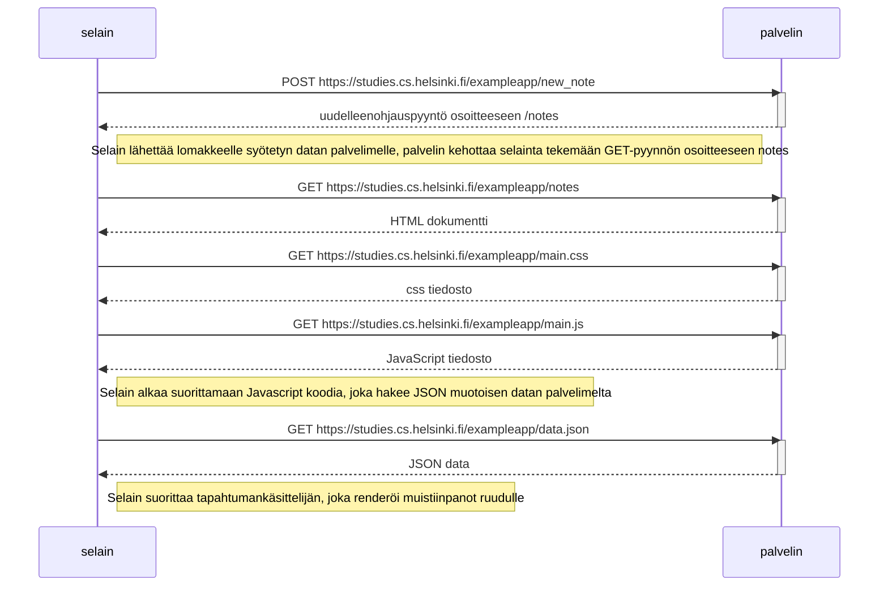

```mermaid
sequenceDiagram
    participant selain
    participant palvelin

   selain->>palvelin: POST https://studies.cs.helsinki.fi/exampleapp/new_note
    activate palvelin
    palvelin-->>selain: uudelleenohjauspyyntö osoitteeseen /notes
    deactivate palvelin

    Note right of selain: Selain lähettää lomakkeelle syötetyn datan palvelimelle, palvelin kehottaa selainta tekemään GET-pyynnön osoitteeseen notes
    
   selain->>palvelin: GET https://studies.cs.helsinki.fi/exampleapp/notes
    activate palvelin
    palvelin-->>selain: HTML dokumentti
    deactivate palvelin
    
   selain->>palvelin: GET https://studies.cs.helsinki.fi/exampleapp/main.css
    activate palvelin
    palvelin-->>selain: css tiedosto
    deactivate palvelin
    
   selain->>palvelin: GET https://studies.cs.helsinki.fi/exampleapp/main.js
    activate palvelin
    palvelin-->>selain: JavaScript tiedosto
    deactivate palvelin
    
    Note right of selain: Selain alkaa suorittamaan Javascript koodia, joka hakee JSON muotoisen datan palvelimelta
    
   selain->>palvelin: GET https://studies.cs.helsinki.fi/exampleapp/data.json
    activate palvelin
    palvelin-->>selain: JSON data
    deactivate palvelin    

    Note right of selain: Selain suorittaa tapahtumankäsittelijän, joka renderöi muistiinpanot ruudulle 
```