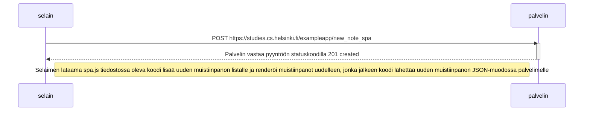

```mermaid
sequenceDiagram
    participant selain
    participant palvelin
  
  selain->>palvelin: POST https://studies.cs.helsinki.fi/exampleapp/new_note_spa
  activate palvelin
  palvelin-->>selain: Palvelin vastaa pyyntöön statuskoodilla 201 created
  deactivate palvelin

  Note right of selain: Selaimen lataama spa.js tiedostossa oleva koodi lisää uuden muistiinpanon listalle ja renderöi muistiinpanot uudelleen, jonka jälkeen koodi lähettää uuden muistiinpanon JSON-muodossa palvelimelle
```